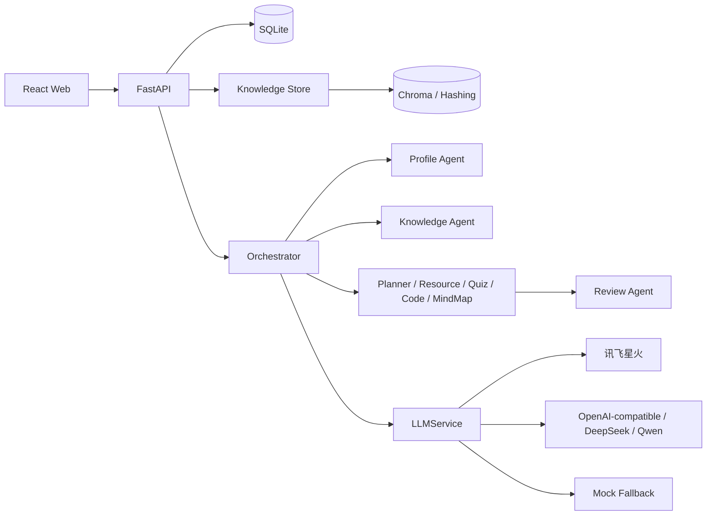

# 系统架构说明

```mermaid
flowchart LR
  UI[React Web] --> API[FastAPI]
  API --> DB[(SQLite)]
  API --> KB[Knowledge Store]
  KB --> CH[(Chroma / Hashing)]
  API --> ORCH[Orchestrator]
  ORCH --> P[Profile Agent]
  ORCH --> K[Knowledge Agent]
  ORCH --> G[Planner / Resource / Quiz / Code / MindMap]
  G --> R[Review Agent]
  ORCH --> LLM[LLMService]
  LLM --> S[讯飞星火]
  LLM --> O[OpenAI-compatible / DeepSeek / Qwen]
  LLM --> M[Mock Fallback]
```

资源生成使用 LangGraph 风格状态对象，但 MVP 不强依赖 LangGraph：状态依次经过知识检索、路径规划、并行生成和事实审校节点，后续可直接替换为真实 StateGraph。

长任务通过 SSE 返回 `progress`、`citations`、`resource`、`review` 和 `done` 事件，避免页面长时间白屏。
