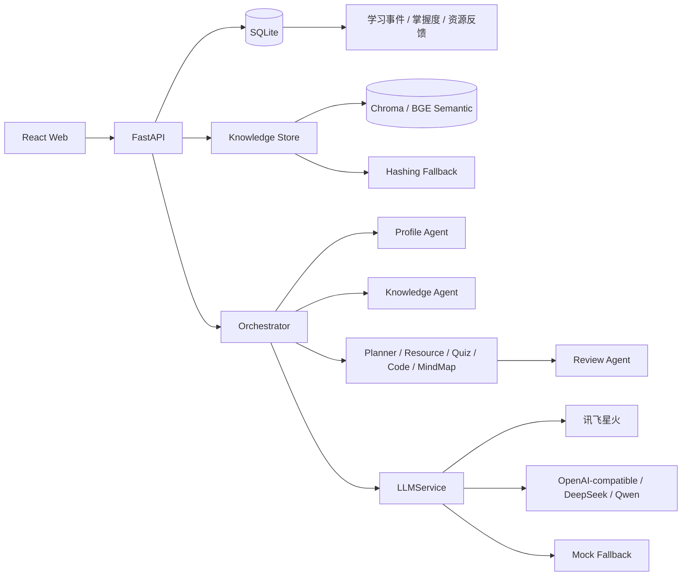

# 系统架构说明



资源生成使用 LangGraph 风格状态对象，但 MVP 不强依赖 LangGraph。当前保存并展示以下真实状态：

```text
profile_loaded
→ knowledge_retrieved
→ plan_generated
→ resources_generated
→ quiz_generated
→ review_completed
→ saved
```

资源包同时保存 `profile_snapshot`、`citations`、`workflow` 和 `agent_outputs`，可以追溯每类资源由哪个 Agent 生成。

长任务通过 SSE 返回 `progress`、`citations`、`resource`、`review` 和 `done` 事件，避免页面长时间白屏。

当前优先使用 `sentence-transformers` 加载 `BAAI/bge-small-zh-v1.5`，模型或依赖不可用时自动切换 Hashing MVP 检索。两种模式均由前端和 `/api/config/status` 如实展示。

学习分析层新增三类可审计数据：

- `learning_events`：采用轻量 actor（当前画像）—verb—object 结构记录真实学习行为，设计思想参考 xAPI，但不宣称完整兼容。
- `mastery_records`：按知识点累计真实逐题得分、尝试次数和最近得分。
- `resource_feedback`：记录资源包是否有帮助，为后续推荐策略提供学生反馈证据。
